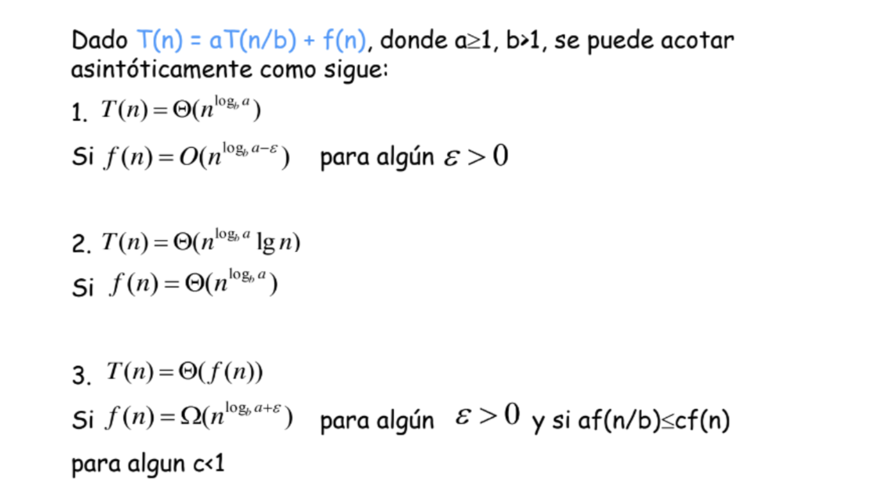

# Analisis de complejidad

## Problema 1 (BINARY SEARCH):

### Complejidad `binarySearch`:

Para hallar la complejidad del algoritmo debemos hallar primero la de la búsqueda binaria.

La función binarySearch toma una lista a de longitud "n" y realiza la búsqueda binaria en ella. En cada llamada recursiva, divide la lista en la mitad y realiza una única comparación.

La relación de recurrencia se puede describir de la siguiente manera:

$$T(n) = T\left(\frac{n}{2}\right) + O(1)$$ 

Donde:

- $T(n)$ representa el tiempo que toma resolver el problema para una lista de longitud "n".
- $T(\frac{n}{2})$ representa el tiempo que toma resolver un subproblema de la mitad del tamaño.
- $O(1)$ representa el tiempo constante necesario para realizar una comparación en cada llamada.

Usando el método maestro para calcular la complejidad asintótica obtenemos lo siguiente:

$a = 1$

$b = 2$

$f(n) = O(1)$

$logb(a) = 0$

Los casos son: 



**Primer Caso:**

En el primer caso no se cumple que  $1 = O(n^{0 - E} )$ debido a que no existe un $E>0$ que permita cumplir con esta complejidad.

**Segundo Caso:**

En el segundo caso si se cumple que $1 = \theta(n^0) = θ(1)$ por lo tanto, tenemos que su complejidad asintótica sería:
$$T(n) = \theta(\log(n))$$

Entendemos que el método searchIndex itera a través de la lista `b`, que tiene un tamaño de `m`, con el propósito de invocar al método binarySearch para determinar el índice de cada clave en la lista `a`, que tiene un tamaño de `n`.

Por lo tanto, la complejidad de recorrer la lista b sería de $O(m)$. Sin embargo, también debemos considerar su llamada a binarySearch, por lo que multiplicamos las complejidades de ambos. En consecuencia, la complejidad asintótica del primer problema sería 
$$O(m \log(n))$$

---

## Problema 2 (MAJORITY ELEMENT):

La ecuación de recurrencia para este algoritmo es `T(n) = 2T(n/2) + n`. Esto se debe a que el algoritmo divide la lista en dos mitades (`left` y `right`) y resuelve el problema para cada mitad recursivamente. Esto corresponde a los dos términos `T(n/2)`. Luego, cuenta las ocurrencias de los elementos mayoritarios en la lista completa, lo que toma tiempo lineal, es decir, `(n)`.

Para contar las ocurrencias se uso una función proppia de Scala llamada `count()` y como se meciono anteriormente la complejidad de esto es lineal, o sea $O(n)$ esto se refleja en la formula de recurrencia.

Si se busca en internet aparece que la complejidad de `count()` es $O(n)$, entonces ahorita se pondra el codigo y se explicara esto:

El codigo de `count()` segun la documentacion de Scala es:

```scala
  def count(p: A => Boolean): Int = {
    var res = 0
    val it = iterator
    while (it.hasNext) if (p(it.next())) res += 1
    res
  }
```


El motivo de que la complejidad sea lineal es porque la función `count` itera a través de cada elemento en el objeto iterable llamando a la función `p` para cada elemento y contando aquellos para los cuales `p` devuelve `true`. En el peor caso, la función `p` debe ser llamada una vez para cada elemento en el objeto iterable.

Dado que la función `iterator` generalmente es una operación de tiempo constante, la complejidad principal de esta función `count` está en el bucle `while` que recorre los elementos. Por lo tanto, la complejidad es lineal, O(n), donde "n" es el número de elementos en el objeto iterable.


**Caracteristicas del codigo:**

- La función `majorityTrigger` se llama recursivamente en las mitades izquierda y derecha de la lista.
- Si los elementos mayoritarios de ambas mitades son iguales, ese es el elemento mayoritario de la lista completa.
- Si no son iguales, cuenta las ocurrencias de ambos elementos en la lista completa. El que tenga más de `n/2` ocurrencias es el elemento mayoritario.
- Finalmente, la función `majorityElement` verifica si el elemento mayoritario ocurre más de `n/2` veces. Si es así, devuelve 1, si no, devuelve 0.

Para calcular la complejidad asintótica, usaremos el método maestro:

El método maestro se aplica para las ecuaciones de recurrencia con esta forma:

$$T(n) = aT\left(\frac{n}{b}\right) + f(n)$$

Donde se cumple que $a \geq 1$, $b > 1$.

La fórmula de recurrencia es:

$$T(n) = 2T\left(\frac{n}{2}\right) + n$$

Entonces:

$a = 2$  
$b = 2$  
$f(n) = n$

Ahora se calcula el valor de $c$ para así poder comparar en cada caso del método maestro:

$$c = \log_b(a)$$

$$c = \log_2(2) = 1$$

Por último, ya teniendo este valor, procedemos a evaluar este valor en un caso que se cumpla en el método maestro para así poder dar una estimación asintótica de la complejidad temporal.

Los casos son: 


**El caso que se cumple es el caso 2:**

Para nuestra fórmula tenemos:

$$f(n) = n$$
$$n^c = n^1 = n$$

Si se cumple que $n = (n^1)$, entonces la estimación asintótica de la complejidad temporal del algoritmo es:

$$T(n) = \theta(n \log n)$$


## Problema 3 (ORGANIZING A LOTTERY):

En este problema lo que se hace es contar cuantas veces se encuentra un número en todos los segmentos dados, para esto se usa la función `countNumber.`Y para lograr que la función ``countNumber`` obtenga el numero a buscar, se usa la función `repeat`.
Por lo cual la complejidad de este problema será la multiplicación de la complejidad del `countNumber` por la de `repeat`, ya que, una se encuentra dentro de la otra.

### Complejidad `countNumber`:

---

La función ``countNumber`` toma una lista r de longitud "n" y realiza la búsqueda de un número en ella. En cada llamada recursiva, llama por parejas de números, es decir, toma números de dos en dos y realiza una única comparación.
Como esta función siempre va a dividir la lista en un segmento y el resto de la lista, y cada segmento sería dos parejas de números, por lo que si se recorren todos los segmentos, sería la cantidad de números divido 2. Finalmente, como ignoramos las constantes la complejidad es de 
La relación de recurrencia se puede describir de la siguiente manera:

$$O(n)$$
### Complejidad `repeat`:

---

La función ``repeat`` toma una lista n de longitud "m" recorre dicha lista elemento por elemento, por lo tanto, se dice que su complejidad directamente sería:

$$O(m)$$
Para terminar se multiplica la complejidad de cada algoritmo quedando así que el algoritmo total tiene una complejidad que depende la cantidad de elementos de cada lista:

$$T(n,m) = O(m*n)$$

### Recurrence Equation
Para completar el trabajo solicitado en la rúbrica, se analizará solamente la función `countNumber` donde su Ecuación de Relación de Recurrencia sería la siguiente:
$$T(n) = T(n-2) + O(1)$$
Donde "n-2" viene dado por que en cada iteración se eliminan dos elementos de la lista "n",  esto para usar el elemento izquierdo para el límite izquierdo del rango e igualmente para el lado derecho. Y el "O(1)" es debido a que se hace una única comparación en el cuerpo del código.
